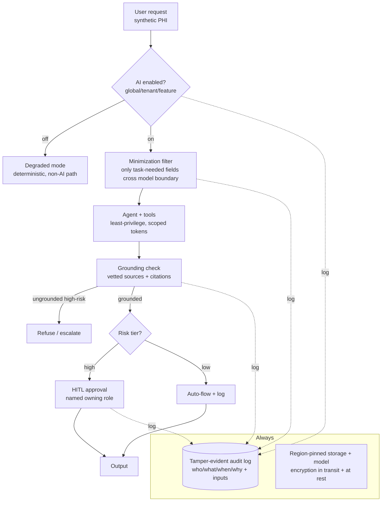

# project-302-regulated-domain-agent-architecture — Reference Solution

> This is a **reference exemplar**, not the only correct answer. The sector menu —
> healthcare, finance, public sector, education technology — is **genuinely balanced**;
> none is privileged or easier. This walkthrough works **healthcare (HIPAA)** as the
> primary sector and uses **finance (GLBA/PCI/SOX)** as the portability peer, only
> because picking concrete sectors makes the controls legible. A submission that works
> finance, public sector, or edtech as primary — with the same rigor and the same
> regime-agnostic-vs-regime-specific discipline — scores identically. To make the
> neutrality real, the portability section re-derives the controls for finance *and*
> sketches the public-sector and edtech deltas so the design is shown to be principled,
> not over-fitted to one regime.

## Approach

The whole grade turns on one distinction, and the reference keeps it explicit from the
first page: **which controls are intrinsic to responsible agentic design** (true in
every sector) **and which are shaped by a specific regulatory regime** (change when the
regime changes). Confusing the two is how architectures over-fit to one law and break
when the product enters a second market.

The regime-agnostic spine (the same in all four menu sectors):

- **Auditability** — every consequential action logged tamper-evidently with
  who/what/when/why.
- **Human-in-the-loop on high-risk output** — a risk taxonomy with a threshold above
  which a human must approve.
- **Hallucination containment** — high-risk factual output grounded in vetted sources
  with citations; refuse or escalate when grounding fails.
- **Toggleable AI** — disable at global/tenant/feature granularity with a safe degraded
  mode.
- **Fail-closed** — when grounding, authorization, or a required approval is
  unavailable, refuse; never proceed open.

The regime-specific layer (re-derived per sector in the portability analysis):

- **Data residency** — where data may physically live.
- **Consent / parental consent / age-gating** — who must agree before processing.
- **Retention and deletion** — how long records must or must not be kept.
- **Breach notification** — who must be told, how fast.
- **Access regime specifics** — minimum-necessary (HIPAA) vs. cardholder-data isolation
  (PCI) vs. FOIA-style disclosure (public sector) vs. vendor-data-use limits (FERPA).

The worked sector is healthcare because PHI gives a clean, well-documented obligation
set; the design rationale is then shown to hold for finance and to flex for the other
two. Synthetic records only, throughout.

## Reference architecture and artifacts

### Sector choice and ADR set (`adrs/`)

Eight ADRs (the spec asks ≥6). Load-bearing ones:

| ADR | Decision |
|-----|----------|
| ADR-001 Sector | Healthcare/HIPAA primary; finance/GLBA portability peer; menu treated as balanced |
| ADR-002 Grounding | "Vetted source" = the tenant's licensed clinical reference set + the patient's own structured record; the model may not ground on its own prior output |
| ADR-003 HITL threshold | Human approval required for any output that asserts a clinical fact about a specific patient or proposes a care action; general education content flows automatically with logging |
| ADR-004 Residency | Region-pinned storage + region-pinned model endpoints; no PHI leaves the contracted region |
| ADR-005 Toggle design | Global / tenant / per-feature flags, evaluated fail-closed (unknown flag state ⇒ AI off) |
| ADR-006 Audit log | Append-only, hash-chained, queryable; captures inputs that produced each decision |
| ADR-007 Accountability | Each automated decision class has a named owning role (e.g. the supervising clinician for care-relevant output) |
| ADR-008 Open questions | Recorded compliance unknowns (e.g. exact BAA boundaries) rather than hidden |

### Reference architecture + diagrams (`architecture/`)

Sequence views show: (1) a high-risk path (request → minimize → ground → HITL approve →
output, every hop logged) and (2) a fail-closed path (grounding unavailable → refuse →
audit record of the refusal). Diagrams, the control-mapping matrix, and the specs are
mutually consistent.

### Data-handling specification (`data-handling/`) — FR-1

| Classification | Example field (synthetic) | Handling |
|----------------|---------------------------|----------|
| PHI — direct identifier | name, MRN | Encrypted at rest + in transit; never sent to model unless the task needs it |
| PHI — clinical | diagnosis, medication | Region-pinned; minimized to the task; citation-grounded if asserted |
| Quasi-identifier | ZIP, DOB | Minimized/aggregated before the model boundary |
| Non-PHI | de-identified aggregates | May flow with logging |

**Minimization at the model boundary** is the key control: a filter strips every field
the current task does not require *before* the prompt is assembled (HIPAA
minimum-necessary, enforced architecturally rather than by policy). **Residency:**
storage and model endpoints pinned to the contracted region. **Retention/deletion:**
PHI retained per the tenant's record-retention obligation, then hard-deleted;
audit-log entries retained longer (tamper-evidence) but carry no raw PHI — they
reference record IDs.

### Control-mapping matrix (`control-mapping/`) — NFR defensibility

Every obligation traces to a concrete control and the FR it satisfies. Excerpt:

| Obligation (HIPAA) | Architectural control | Satisfies |
|--------------------|-----------------------|-----------|
| Minimum-necessary access | Minimization filter at model boundary | FR-1 |
| Audit controls (§164.312(b)) | Hash-chained append-only audit log | FR-2 |
| Right to access / amend | Data-subject request flow into the same audit trail | NFR observability |
| Integrity of ePHI | Encryption + tamper-evident log | FR-1/FR-2 |
| Person/entity authentication | Scoped, revocable least-privilege tokens | NFR least-privilege |

A compliance reviewer reads this matrix top to bottom and confirms no obligation is
unmapped.

### Risk taxonomy + HITL flows (`hitl/`) — FR-3

| Risk tier | Definition | Flow |
|-----------|------------|------|
| High | Asserts a clinical fact about a specific patient, or proposes a care action | **Mandatory HITL** by the named owning role; fail-closed if no approver |
| Medium | Summarizes the patient's own record back to them | Auto-flow with grounding + logging; spot-audited |
| Low | General, non-patient-specific education content | Auto-flow with logging |

The threshold (ADR-003) is justified by **irreversibility and harm-to-person**, not by
volume. Above the line, a human approves; the approval, approver, and inputs are logged.

### Grounding + hallucination containment (`grounding/`) — FR-4

"Vetted source" is defined concretely (ADR-002): the tenant's licensed clinical
reference set plus the patient's own structured record. High-risk factual output **must**
carry a citation to a vetted source. When the agent cannot ground a high-risk claim, it
**refuses or escalates** — it never emits an unsupported clinical assertion. The
mechanism: a grounding checker compares each high-risk claim against retrieved vetted
spans; no span ⇒ refuse + audit the refusal.

### Toggleable AI + degraded mode (`toggles/`) — FR-5

Flags at **global / tenant / feature** granularity, evaluated **fail-closed** (unknown
or unreachable flag state ⇒ AI off). The **safe degraded mode** is the deterministic
non-AI path: templated responses, human-routed requests, full functionality minus the
AI assist — the product stays up. Every toggle change is an **audit record** (who
flipped it, when, scope).

### Portability analysis (`portability/`) — FR-6 (the neutrality proof)

Re-deriving FR-1…FR-5 for **finance (GLBA/PCI/SOX)** as the primary peer:

| Control | Healthcare → Finance | Class |
|---------|----------------------|-------|
| FR-1 Data handling | PHI → NPI + cardholder data; **cardholder data isolation (PCI)** replaces minimum-necessary; residency relaxed in some regimes, tightened by PCI scope | **Replaced / tightened** |
| FR-1 Retention | Clinical retention → SOX financial-record retention (often longer) | **Tightened** |
| FR-2 Auditability | Same tamper-evident log; SOX adds financial-reporting integrity attestations | **Tightened (extended)** |
| FR-3 HITL | High-risk = "moves money / affects credit" instead of "affects care" | **Unchanged mechanism, redefined trigger** |
| FR-4 Grounding | Vetted source = authoritative financial records, not clinical references | **Unchanged mechanism, replaced source set** |
| FR-5 Toggles | Identical | **Unchanged** |

Sketched deltas for the other two menu sectors (showing the design flexes, not breaks):

- **Public sector:** FR-2 audit gains **FOIA-style disclosure** obligations (the log may
  itself be disclosable); residency tightens to authorization-to-operate boundaries;
  accessibility becomes a first-class output requirement.
- **Edtech (FERPA/COPPA):** FR-1 adds **parental consent and age-gating** *before*
  processing; vendor-data-use limits constrain what the model provider may retain;
  HITL trigger = "affects a student's record."

**Conclusion (the explicit split):** *regime-agnostic responsible-AI controls* are
auditability, HITL-on-high-risk, grounding/containment, toggleability, and fail-closed —
the mechanisms are identical across all four sectors; only their *triggers* and *source
sets* are re-parameterized. *Regime-specific controls* are residency, consent/age-gating,
retention duration, breach-notification, and the access model (minimum-necessary vs.
cardholder-isolation vs. FOIA vs. vendor-use-limits). The architecture is principled
because the spine never changed — only the parameters did.

## How it meets the acceptance criteria and rubric

- **Exactly one primary sector, justified** — healthcare in ADR-001, menu treated as
  balanced.
- **Data classified with residency/minimization/retention** — the data-handling table
  and minimization filter.
- **Control-mapping matrix traces each obligation** — the matrix maps HIPAA obligations
  to controls and FRs.
- **Tamper-evident, queryable audit (who/what/when/why)** — hash-chained append-only log
  capturing inputs.
- **Explicit accountability** — named owning role per automated decision class
  (ADR-007).
- **Risk taxonomy + HITL threshold** — three tiers, mandatory HITL above the line.
- **Grounding + refuse/escalate** — vetted-source definition and the no-span-⇒-refuse
  mechanism.
- **Toggleable global/tenant/feature + degraded mode + audit** — the toggle spec.
- **Fail-closed** — unknown flag, missing grounding, or missing approver all refuse.
- **Portability re-derives all five for a second sector, classified** — the finance
  table with unchanged/tightened/relaxed/replaced.
- **Explicit regime-agnostic vs. regime-specific split** — the conclusion.
- **No sector privileged** — finance fully re-derived; public-sector and edtech deltas
  sketched.

Rubric coverage: **regulatory translation (25%)** — obligations become concrete controls
in a complete matrix; **data handling/residency (15%)** — classification, minimization,
residency, retention all specific; **auditability/accountability (15%)** —
tamper-evident reconstructable log with named ownership; **HITL/risk taxonomy (15%)** —
well-reasoned tiers with consistent fail-closed; **hallucination containment (15%)** —
vetted-source grounding with refuse/escalate; **portability (15%)** — rigorous
re-derivation cleanly splitting agnostic from specific.

## Common pitfalls

- **Smuggling regime-specific controls into the agnostic spine (or vice versa).** The
  single most common failure is listing "data residency" as a universal responsible-AI
  control — it is regime-specific and changes across the menu. Conversely, treating HITL
  as HIPAA-only misses that it is the agnostic spine. The portability table is where this
  error surfaces; if every row is "unchanged" or every row is "replaced," you have not
  separated the layers.
- **"The model is usually right" as a control.** The auditor rejects this on the first
  page. Grounding-or-refuse, not model confidence, is the control. High-risk output with
  no vetted citation must refuse.
- **Fail-open toggles.** If an unreachable flag service means AI stays *on*, the kill
  switch is theater. Unknown flag state must mean AI *off*.
- **Audit logs that contain raw PHI.** The log must be tamper-evident and retained
  longer than the records — so it must reference record IDs, not embed the sensitive
  fields, or the retention/deletion obligation is violated by the audit trail itself.
- **Privileging the chosen sector.** If the rationale only works for healthcare, the
  design is over-fitted. Re-derive a full second sector and sketch the rest — as this
  reference does — so the neutrality is demonstrated, not asserted.
- **Real regulated data.** Use synthetic records only; a single real MRN or card number
  fails the submission outright.

## Verification

A completed submission is correct when:

- ADR-001 names exactly one primary sector from the menu and justifies it without
  implying the others are inferior.
- The control-mapping matrix has no unmapped obligation; a reviewer can trace each
  obligation → control → FR in one pass.
- The audit log is append-only and tamper-evident (e.g. hash-chained), is queryable for
  who/what/when/why, and contains no raw sensitive fields (only record references).
- A high-risk output with no vetted-source citation is **refused**, and the refusal is
  itself audited (fail-closed demonstrated).
- Flipping the AI toggle off at global, tenant, and feature scope each leaves the
  product in the defined degraded mode, and each flip is audited; an unreachable flag
  service results in AI off.
- The portability analysis re-derives all five control areas for a second menu sector
  and labels each unchanged/tightened/relaxed/replaced, ending with an explicit
  agnostic-vs-specific split.
- No real regulated data appears anywhere in the package.
