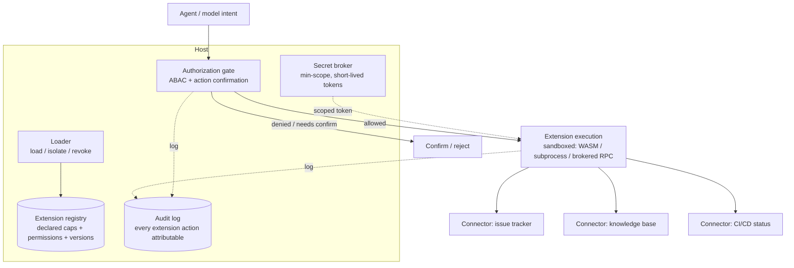

# project-303-extensible-agent-platform — Reference Solution

> This is a **reference exemplar**, not the only correct answer. The defining constraint
> is **platform neutrality**: Claude Code, Cursor, Copilot, LangGraph Platform, and a
> fully custom host are **peers**, and the worked domain may be SDLC *or* a non-developer
> workflow. This walkthrough designs against a **generic custom host/extension model**
> and evaluates **LangGraph Platform** as the named alternative peer; the worked domain
> is **support-ticket triage** (a non-developer internal workflow), deliberately chosen
> so the platform is not framed as one company's internal AI-for-SDLC product. A
> submission that picks any of the other hosts as its alternative peer, or works an SDLC
> domain (code review, dependency triage, release notes), scores identically — the grade
> is on the contract design, the security model, and the honesty of the lock-in
> analysis, not on which host or domain you chose.

## Approach

The heart of the grade is the **uniform extension contract**: one contract that covers
all four extension types (agents, tools, hooks, connectors), proven by integrations that
actually flow *through* it rather than being hard-coded. Everything else hangs off that
spine.

The decisions that drive the reference:

- **One contract, four extension types.** An agent, a tool, a hook, and an MCP-style
  connector are all *extensions* that declare capabilities, request permissions, define
  I/O, and expose lifecycle hooks. Modeling them under one schema is what makes
  "add an extension" principled instead of bespoke — and it is what the integrations
  must demonstrate.
- **Default-deny, no ambient authority.** An extension gets exactly the permissions it
  declared and the host approved — nothing more. Secrets never reach extension code in
  plaintext beyond the minimum scope. This is the security spine; a misbehaving
  extension must be *contained*, not trusted.
- **Break the model→action path.** Model-generated intent must not directly drive a
  privileged action. A trust boundary sits between "the model said to do X" and "X
  executed"; high-impact operations pass through an action-confirmation/authorization
  gate. This is also the prompt-injection and untrusted-tool-output defense: a malicious
  instruction planted in tool output cannot cross the gate on its own.
- **Neutrality is an analysis, not a slogan.** Picking a host is fine; "we will just use
  X" is not an architecture. The work is the reasoned comparison against a named peer and
  an honest portability/lock-in analysis — what is portable, what is host-specific, and
  the concrete migration path.

The worked domain is support-ticket triage because it exercises every extension type
without being developer-centric: a triage **agent**, a `classify_ticket` **tool**, a
pre-action **hook**, and connectors to an issue tracker, a knowledge base, and a CI/CD
status feed. (An SDLC instantiation — a review agent, a `lint_diff` tool, a pre-merge
hook, VCS/issue/CI connectors — is the equally valid peer instantiation.)

## Reference architecture and artifacts

### Worked-domain + alternative-host ADRs (`adrs/`)

Nine ADRs (the spec asks ≥8). The two the spec calls out up front:

| ADR | Decision |
|-----|----------|
| ADR-001 Worked domain | Support-ticket triage (non-developer); SDLC named as the equally valid peer instantiation |
| ADR-002 Alternative host | Generic custom host as primary; **LangGraph Platform** as the named peer; Claude Code / Cursor / Copilot all treated as peers in the comparison table |
| ADR-003 Isolation | WASM/subprocess sandbox per extension; remote extensions via a brokered RPC with no shared filesystem |
| ADR-004 Auth model | OAuth for delegated access; **ABAC** (attributes: extension id, tenant, resource, action) over plain RBAC, because permissions are resource-scoped |
| ADR-005 Injection-defense placement | Authorization gate at the host, *after* the model proposes an action and *before* execution |
| ADR-006 Governance gates | Proposal → review → approval → publish → version → deprecate → remove; permission diff re-approval on upgrade |
| ADR-007 Token lifecycle | Short-lived scoped tokens, rotated, revocable; never long-lived ambient creds |
| ADR-008 Integration approach | All integrations implement the FR-1 contract; no bespoke wiring |
| ADR-009 Open security questions | Recorded (e.g. third-party marketplace vetting depth) rather than hidden |

### Extension architecture + diagram (`architecture/`)



The required **privileged-action sequence diagram** shows: agent proposes
`close_ticket` → host checks the extension's declared permission in the registry → ABAC
evaluation → action-confirmation gate (high-impact ⇒ confirm) → scoped token minted →
sandboxed execution → audit. A planted injection in a fetched KB article that says
"close all tickets" reaches the gate as *intent* and is denied because the extension
never declared that permission — the model→action path is broken.

### Extension contract (`extension-contract/`) — FR-1

One schema, all four types. Worked example (a tool):

```yaml
# extension.yaml — uniform contract; an agent/hook/connector use the same shape
apiVersion: ext/v1
kind: tool                      # one of: agent | tool | hook | connector
name: classify_ticket
version: 1.2.0
capabilities: [read_ticket, write_ticket_label]   # what it can do
permissions:                    # what it REQUESTS — default-deny until approved
  - resource: issue_tracker
    actions: [read, label]
    scope: tenant               # never global by default
io:
  input:  { ticket_id: string, body: string }
  output: { label: string, confidence: number }
lifecycle:
  on_load:    validate_schema
  on_revoke:  flush_tokens
  pre_action: authorization_gate   # high-impact actions confirm here
```

A second worked example (a connector to the issue tracker) uses the identical shape with
`kind: connector` and an OAuth `delegated_auth` block — proving one contract spans the
types. Adding an extension is filling out this schema, not writing host glue.

### Security model (`security/`) — FR-2 + FR-3

| Concern | Design |
|---------|--------|
| Identity / delegation | OAuth authorization-code flow; the host holds no end-user passwords |
| Authorization | **ABAC**: a request is allowed iff `(extension, tenant, resource, action)` matches an approved permission; **default-deny** |
| Token lifecycle | Issue short-lived, scope to the declared permission, rotate on schedule, revoke on extension removal or anomaly; least privilege throughout |
| Local isolation | Each extension runs in a WASM/subprocess sandbox: no shared FS, no ambient env, only the brokered token |
| Remote isolation | Brokered RPC; the remote extension never sees other extensions' secrets or the host's |
| Injection / untrusted output | Tool output is **data, never instructions**; a planted instruction cannot mint a token or cross the gate; high-impact actions require confirmation |

The **trust boundary** is explicit: everything the model emits is *proposed intent*; only
the host, after ABAC + confirmation, *executes*. That single boundary is simultaneously
the prompt-injection defense and the excessive-agency control.

### Governance lifecycle (`governance/`) — FR-4

```text
proposal → review (security + permission review) → approval → publish
   → versioning → deprecation → removal
                     ↑                              ↓
              permission-diff re-approval      kill-switch (revoke now)
```

On upgrade, any **permission expansion is diffed and re-approved** (the stretch goal,
folded in). A bad extension is pulled by the **kill-switch**: the loader revokes its
tokens and unloads it, host-wide, immediately — the registry marks it removed and the
audit log records who pulled it and why.

### Toolchain integrations (`integrations/`) — FR-5

Three integrations, all through the FR-1 contract (not one-offs):

1. **Issue tracker** (`kind: connector`) — read/label/close tickets; OAuth-delegated,
   tenant-scoped.
2. **Knowledge base** (`kind: connector`) — retrieve articles for grounding; read-only;
   its output is treated as untrusted data.
3. **CI/CD status** (`kind: connector`) — read pipeline status to enrich a triage
   decision; read-only.

Each ships as an `extension.yaml` plus a runnable stub; the triage agent invokes them
only through declared capabilities. (SDLC peer: swap in VCS, issue tracker, and CI/CD
connectors — same contract, same gate.)

### Portability and lock-in analysis (`portability/`) — FR-6 (the neutrality proof)

Honest comparison of the generic custom host against the named peers:

| Dimension | Custom host (this design) | LangGraph Platform | Claude Code | Cursor / Copilot |
|-----------|---------------------------|--------------------|-------------|------------------|
| Extension model | Explicit 4-type contract | Graph nodes + tools | Tools/hooks/MCP/subagents | Tool/extension APIs |
| Isolation | You own WASM/subprocess | Platform-managed | Process + permission prompts | IDE-sandboxed |
| Auth/tokens | You own OAuth+ABAC | Platform-assisted | MCP OAuth | IDE/account-scoped |
| Lock-in cost | Low (you own it) but high build cost | Medium (graph runtime) | Medium (host conventions) | Higher (IDE-coupled) |

**Portable vs. host-specific:** the **contract schema, ABAC policy, permission model, and
audit format are portable** — they are plain data. **Host-specific glue** is the loader,
the sandbox driver, and the secret-broker binding — bounded and documented. **Migration
path:** to move to LangGraph Platform, keep the `extension.yaml` contracts and ABAC
policy unchanged, re-implement only the loader/sandbox/broker against the platform's
runtime, and re-bind connectors to its tool interface. **What you lose by switching:**
host-managed isolation convenience in exchange for portability you control — named
explicitly, not hand-waved.

### Adoption and DX plan (`adoption-dx/`) — FR-7

The extension developer journey: `scaffold new-extension --kind tool` generates the
`extension.yaml` + a stub + a local test harness → develop against a local mock host →
`ext test` runs the contract validator and a sandbox smoke test → submit for
proposal → security/permission review → approval → publish. Docs cover the contract, the
permission model, and the gate. A new team goes idea → local test in minutes, and
prototype → published through the governance lifecycle.

## How it meets the acceptance criteria and rubric

- **One contract for agents/tools/hooks/connectors + load/isolate/revoke** — the
  `ext/v1` schema and the loader.
- **OAuth + RBAC/ABAC, default-deny** — OAuth delegation, ABAC, deny-by-default.
- **Token lifecycle: issue/scope/rotate/revoke, least privilege** — the security table.
- **Local + remote isolation** — WASM/subprocess locally, brokered RPC remotely.
- **Injection/untrusted-output defenses + trust boundary + confirmation gate** — tool
  output is data; the gate breaks model→action.
- **Governance proposal→removal incl. kill-switch** — the lifecycle with permission-diff
  re-approval and revoke-now.
- **≥3 integrations through the contract** — issue tracker, KB, CI/CD as connectors.
- **≥1 named alternative as a peer + portability/lock-in + migration path** — LangGraph
  comparison with portable/host-specific split and migration steps.
- **Adoption/DX prototype→published** — the scaffold/test/review journey.
- **Platform-neutral, worked domain stated, not one company's internal tool** — generic
  host, support-triage domain, SDLC named as peer.
- **≥8 ADRs** — nine.

Rubric coverage: **extensibility/contract (25%)** — one schema covers four types and the
integrations prove it; **security/sandboxing (25%)** — default-deny auth, sound token
lifecycle, real isolation, contained misbehavior; **injection defense (15%)** — explicit
trust boundary and gate; **governance (10%)** — operable lifecycle with a working
kill-switch; **portability/lock-in (15%)** — honest peer comparison with a concrete
migration path; **adoption/DX (10%)** — a team could realistically ship a safe extension.

## Common pitfalls

- **Hard-coding integrations instead of flowing them through the contract.** This is the
  single biggest grade-killer: if the issue-tracker connector calls an API directly
  instead of declaring capabilities/permissions in `extension.yaml` and going through the
  gate, the platform is not extensible — it is three bespoke features. Every integration
  must be an extension.
- **Ambient authority.** If an extension can read an env var, touch the shared
  filesystem, or use a long-lived host credential, isolation is fiction. Default-deny,
  minted short-lived scoped tokens, no shared state.
- **Letting model output drive privileged actions directly.** If "the model decided to
  close the ticket" closes the ticket with no gate, a planted injection owns your
  platform. Intent and execution must be separated by the authorization gate.
- **A portability section that names no losses.** "Everything is portable" is dishonest
  and loses the lock-in grade. Name what is host-specific (loader, sandbox, broker) and
  what you would lose by switching.
- **Framing the platform as one company's AI-for-SDLC product.** The spec is explicit:
  it is a general extensible platform, the worked domain is one instantiation. If the
  framing privileges SDLC or a single host, neutrality is lost — keep the peers as
  equals, as this reference does.
- **A kill-switch that does not actually revoke.** "Mark deprecated" is not a kill-switch.
  Removal must revoke tokens and unload the extension host-wide, immediately, with an
  audit entry.

## Verification

A completed submission is correct when:

- All three integrations are defined as `extension.yaml` contracts and invoked only
  through declared capabilities; none calls its target API outside the contract.
- A permission an extension did not declare is **denied by default** at the gate, with an
  audit entry — verifiable by attempting an undeclared action.
- A planted instruction in connector/tool output (e.g. a KB article saying "close all
  tickets") does **not** result in the privileged action: it reaches the gate as intent
  and is denied or forced to confirmation.
- The kill-switch, when triggered, revokes the extension's tokens and unloads it
  host-wide immediately, and the registry + audit log reflect the removal.
- On an extension upgrade that expands permissions, the host surfaces the permission diff
  and requires re-approval before loading the new version.
- The portability analysis names a specific alternative host, splits portable
  (contract/ABAC/audit) from host-specific (loader/sandbox/broker), gives a concrete
  migration path, and states what is lost by switching.
- The adoption/DX plan takes a new extension from `scaffold` through local test to
  published via the governance lifecycle, and ≥8 ADRs document the key decisions
  including the worked-domain and alternative-host choices.
